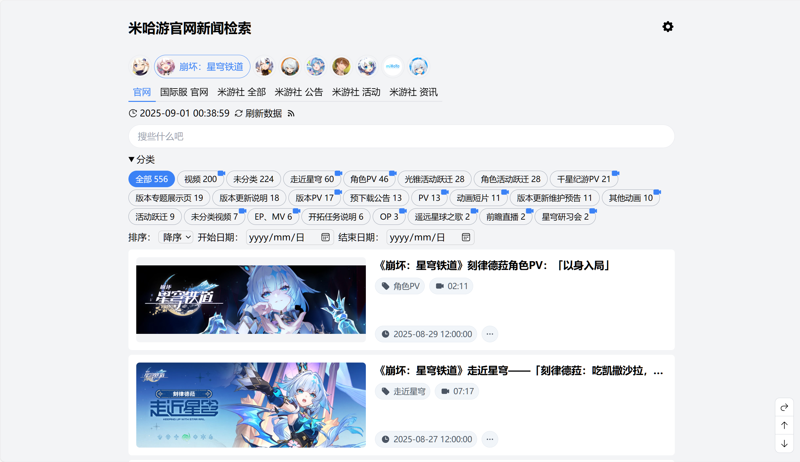

# 米哈游官网新闻检索

<details>
<summary>界面截图</summary>

</details>

一个用于检索米哈游旗下游戏官网新闻的小工具

访问地址1：[news-eo.amarea.cn](https://news-eo.amarea.cn/) (EdgeOne, 推荐)  
访问地址2：[news.hk4e.com](https://news.hk4e.com/) (Vercel, 备用)

官网新闻源支持：`原神` `崩坏：星穹铁道` `崩坏3` `绝区零` `未定事件簿` `米哈游`  
米游社新闻源支持：`原神` `崩坏：星穹铁道` `崩坏3` `未定事件簿` `崩坏学园2` `绝区零` `大别野`  
分类预设支持：`原神` `崩坏：星穹铁道` `绝区零`

> 分类预设当前仅针对官网新闻源进行适配，其他源的匹配结果可能会存在大量错误

- 支持根据预置分类检索新闻
- 支持多关键词搜索，关键词之间使用空格分隔
- 支持快速检索存在视频的新闻
- 支持将视频批量导出为 aria2 下载任务
- 支持在 PotPlayer 中打开视频、将视频发送至 aria2 下载

分类功能使用关键词匹配标题实现，有时官网新闻的标题本身写的也不是非常规范，分类结果有错漏属于正常现象，对分类规则有任何意见请提 Issue

# 附加功能使用说明

## 发送单个视频至 aria2 下载

1. 下载 [aria2](https://github.com/aria2/aria2/releases)
2. 开启 aria2 的 RPC 服务器
3. 在本工具的 `设置` - `下载` 中配置 aria2 的 RPC 地址与密钥
4. 在存在视频的新闻标题下，点击 `更多操作` 中的 `发送至 aria2 下载`，即可将视频发送至 aria2 下载

## 使用 aria2c 批量下载视频

1. 下载 [aria2](https://github.com/aria2/aria2/releases)
2. 选择你要下载的视频源或筛选分类
3. 使用本工具 `设置` - `常规` 中的 `导出本页视频至 aria2 任务` 功能，将视频下载任务导出为文本文件 `videos.txt`，文件名默认使用新闻标题拼接视频文件原有拓展名
4. 使用如下命令将下载任务导入至 aria2

```bash
aria2c -i videos.txt -d ./download --continue --save-session=session.txt
```

这将会将视频下载到当前目录下的 `download` 文件夹中，同时将下载进度保存至 `session.txt` 文件中，如下载中断，重新执行上述命令即可继续下载
